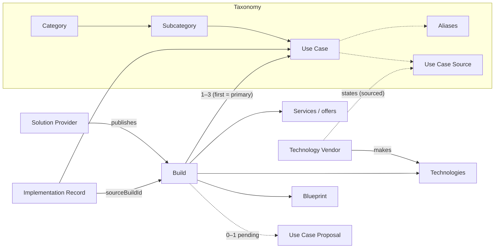

# Supply model

How supply (what Solution Providers offer) meets need (the work a buyer wants done), and what Oracnet counts.

## The graph



Text version, for readers without Mermaid:

```
Technology Vendor ──makes──► Technology ◄──used in── Build ◄──publishes── Solution Provider
        │                                              │  ├─► Blueprint (versioned)
        └─states (with source)─► Use Case ◄──1..3──────┘  ├─► Services / offers
                                    ▲                     └─► 0..1 pending proposal
                                    └──── Implementation Record ──sourceBuildId──► Build
```

## What counts as supply

| Object | Counts as supply? | Why |
| --- | --- | --- |
| Build (public, approved, ≥ 1 approved Use Case) | Yes | Someone offers a solution |
| Build relying only on a pending proposal | Not yet | The Use Case has not been reviewed |
| Vendor statement (“Grok can do X”) | No, it's a source | Capability claim, not an offer |
| Implementation Record | Evidence, not supply | Shows a deployment happened |
| Blueprint | Part of a Build's depth | Architecture you can reuse |

## Counts shown

`getUseCaseStats(useCaseId, data)` returns, for one Use Case:

- **Builds**: indexable Builds that list it.
- **Technologies**, each with its **basis**: named by the vendor, used in N Builds, in N Blueprints, observed in N Implementations. A technology appears only when one of those is true.
- **Implementations**: public, approved Implementation Records linked to it.
- **Solution Providers**: providers of those Builds and implementers of those records.

The UI prints these as plain counts (“2 Builds · 5 Technologies · 1 Implementation”). No score combines them.

## Build maturity and compiler coverage

| Build maturity (`buildMaturity`) | Meaning |
| --- | --- |
| Build only | Published Build, no linked Blueprint, no linked deployment |
| Build + Blueprint | Linked to a published Blueprint |
| Build + deployment evidence | At least one public Implementation Record has `sourceBuildId` = this Build |

| Compiler coverage (`compilerCoverage`) | What “Find a solution” does |
| --- | --- |
| catalogue only | No published Blueprint: shows a notice and links to Use Case, Builds, technologies, projects and publishing. Compile is disabled; nothing is invented. |
| blueprint available | Compiles against Blueprints; candidates say no deployment evidence exists |
| evidence available | Compiles against Blueprints with Implementation Records as evidence |

Every compiled candidate shows its provenance (`candidateProvenance`): the Blueprint, the Solution Provider maintaining it, the Build it comes from, and the public Implementation Records derived from it. In connected mode an admin cannot approve a Build that has only a pending proposal (`guard_build_indexing`).

## Supply gaps

`supplyGaps(data)` lists approved Use Cases ordered by fewest Builds. The provider dashboard (`/creator`) shows it with the note “These counts show where Builds are missing — not how many buyers are looking.” Use Case cards say **No Builds yet** or **Few Builds available** (≤ 2). These are supply facts. Oracnet does not collect search or demand analytics for this, and the UI never implies demand.

## Who can change what

| Actor | Can | Cannot |
| --- | --- | --- |
| Solution Provider | Publish and edit own Builds, offers and Blueprints; propose one Use Case per Build; withdraw a pending proposal | Create public Use Cases directly; edit others' Builds; change taxonomy |
| Technology Vendor (claimed) | Maintain company details, products and its own use-case statements | Edit or remove independent Builds, Implementation Records, evidence or reviews |
| Customer | Attest selected claims through a scoped, single-use link | Edit the record |
| Moderator (admin) | Map, approve, reject, merge, add labels, archive; all audited | Merge automatically; delete history |

These rules are enforced by RLS and triggers in connected mode (`supabase/migrations/202609260001_marketplace_taxonomy.sql`, tested in `tests/security/taxonomy-rls.test.ts`) and by the domain functions in the demo.
